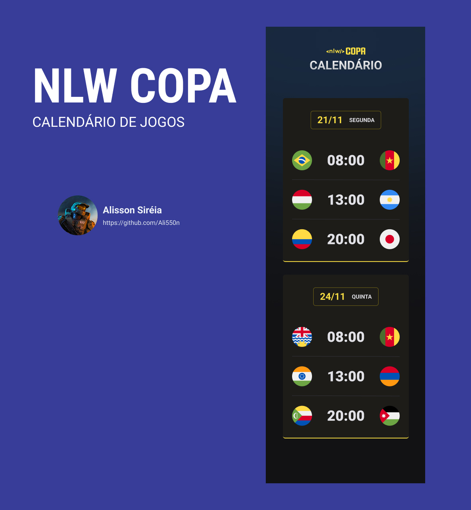
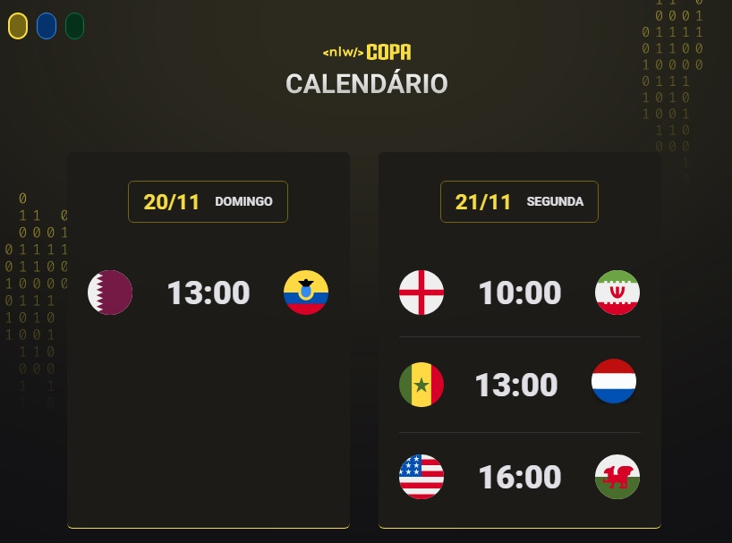
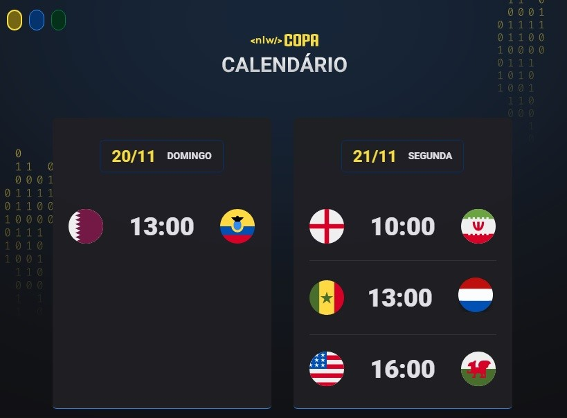
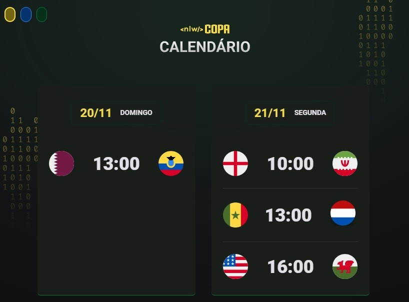

<h1 align="center"> NLW COPA </h1>

Evento exclusivo e gratuito, promovido pela Rocketseat para ensino de tecnologias WEB.

  <a href="#-tecnologias">Tecnologias</a>&nbsp;&nbsp;&nbsp;|&nbsp;&nbsp;&nbsp;
  <a href="#-projeto">Projeto</a>&nbsp;&nbsp;&nbsp;

  

 

  

  

  

  

 

## 🚀 Tecnologias

Esse projeto foi desenvolvido com as seguintes tecnologias:

- HTML e CSS
- JavaScript
- Git e GitHub

 

## 💻 Projeto

O projeto NLW COPA é um caledário estilizado com as datas e horários dos jogos da fase eliminatória da Copa 2022.

 

<h4>EXTRA:</h4>
Foi implementado de além do projeto original a opção de escolha de tema (Amarelo, Azul e Verde), através de botões por meio de manipulação de classe utilizando JavaScript.

 

## 📝 Licença

Esse projeto está sob a licença MIT.

---

Feito com ♥ by Rocketseat 👋
 
[Participe da nossa comunidade!](https://discord.gg/rocketseat)
